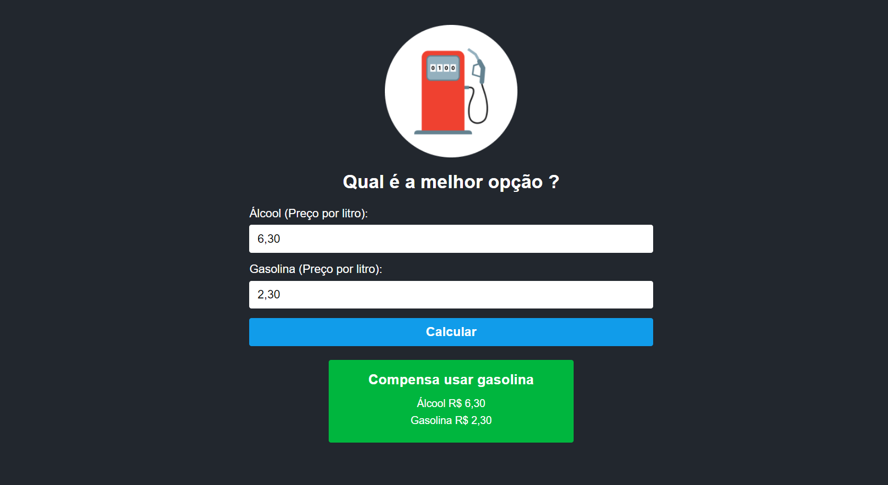

# Calculadora de Gasolina X Álcool

Este projeto é uma calculadora simples para ajudar a determinar se é mais vantajoso abastecer com álcool ou gasolina. Desenvolvido usando React e TypeScript. 

## Demo do projeto

## Funcionalidades

- **Cálculo simples**: Com base nos preços do álcool e da gasolina, a calculadora determina qual combustível é mais vantajoso.
- **Interface intuitiva**: Interface de usuário simples e fácil de usar.
- **Feedback imediato**: Após inserir os valores, o resultado é exibido instantaneamente.

## Tecnologias Utilizadas

- **React**: Biblioteca JavaScript para criar interfaces de usuário.
- **TypeScript**: Um superconjunto de JavaScript que adiciona tipos estáticos.

## Uso
Insira o preço do álcool no campo correspondente.
Insira o preço da gasolina no campo correspondente.
A calculadora irá exibir qual combustível é mais vantajoso usar, baseado na relação de preços.